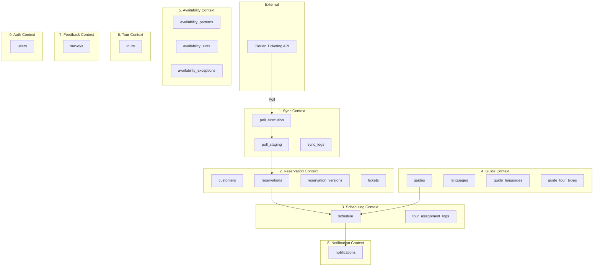

# Oceanarium Project — Architecture & Tech Stack

## 📋 Executive Summary

**Oceanarium** is a tour management system that automates guide assignment, scheduling, and notifications for an aquarium operation. It ingests reservations from an external ticketing system (Clorian), intelligently assigns guides based on language/availability/expertise constraints, and handles dynamic rescheduling.

**Built for:** PROJ309 Capstone at SAIT  
**Client:** HDB Systems  
**Team Philosophy:** Domain-driven design, layered architecture, quality-first with automated testing

---

## 🎯 Core Technology Stack

### Frontend
| Technology | Version | Purpose | Why This Choice |
|------------|---------|---------|----------------|
| **Vue 3** | 3.5.22 | UI Framework | Modern composition API, excellent TypeScript support, smaller bundle size than React, official router/state management |
| **Vite** | 7.1.11 | Build Tool | Lightning-fast HMR, native ESM, optimized production builds, first-class Vue support |
| **Pinia** | 3.0.3 | State Management | Official Vue store, simpler than Vuex, excellent TypeScript inference, modular design |
| **Vue Router** | 4.6.3 | Routing | Official routing solution, guards for auth, nested routes for layouts |
| **Tailwind CSS** | 4.1.17 | Styling | Utility-first, rapid prototyping, consistent design system, minimal CSS bundle |
| **Axios** | 1.13.2 | HTTP Client | Interceptors for auth, request/response transforms, automatic JSON handling |
| **Firebase** | 12.6.0 | Authentication | Production-ready auth, email/password + social providers, token management |

**Dev Tools:**
- **Vitest** (4.0.18) — Fast, Vite-native test runner with 80% coverage threshold
- **ESLint** (10.0.3) — Flat config with Vue plugin for consistent code style
- **Prettier** (3.6.2) — Auto-formatting integrated with ESLint
- **@vue/test-utils** (2.4.6) — Official Vue component testing utilities

### Backend
| Technology | Version | Purpose | Why This Choice |
|------------|---------|---------|----------------|
| **FastAPI** | 0.128.8 | API Framework | Async-first, auto OpenAPI docs, Pydantic validation, fastest Python framework |
| **Python** | 3.11 | Language | Type hints, async/await, dataclasses, wide ecosystem |
| **SQLAlchemy** | 2.0.47 | ORM | Type-safe queries, relationship management, connection pooling |
| **PostgreSQL** | 16 | Database | JSONB for staging data, timezone support, robust constraints, excellent performance |
| **Alembic** | 1.16.5 | Migrations | Version-controlled schema, reversible migrations, SQLAlchemy integration |
| **psycopg2** | 2.9.11 | DB Driver | Battle-tested PostgreSQL adapter, connection pooling |
| **Firebase Admin** | 6.0.0 | Auth Backend | Token verification, user management, matches frontend auth |

**Quality Tools:**
- **Ruff** (≥0.11) — Ultra-fast Python linter + formatter (replaces flake8/black/isort)
- **pytest** (≥8) — Industry-standard testing framework
- **pytest-asyncio** (≥0.25) — Async test support for FastAPI
- **pytest-cov** (≥6) — Coverage reporting with 80% threshold
- **Locust** (≥2.32) — Load testing with CI thresholds (fail ratio <1%, avg response <500ms)

### Infrastructure & DevOps
| Technology | Purpose | Configuration |
|------------|---------|---------------|
| **Docker** | Containerization | Python 3.11-slim base, multi-stage builds |
| **Docker Compose** | Local Development | PostgreSQL + Backend services, health checks |
| **GitHub Actions** | CI/CD | 3 jobs: quality (lint/test), migrations, load tests |
| **AWS EC2** | Hosting | Ubuntu instance with systemd service |
| **AWS RDS** | Production DB | PostgreSQL 16 managed instance |
| **AWS Security Groups** | Network Security | Dynamic SSH access for deployments |
| **Vercel** | Frontend Hosting | CDN delivery, automatic previews |

---

## 🏛️ Architecture Overview

### Architecture Style: **Layered Domain Architecture**
*Reference: [ADR-002](ADR/ADR-002-layered-domain-architecture.md)*

```
┌─────────────────────────────────────────────────────────────┐
│                        FRONTEND (Vue 3)                      │
│  Components → Views → Router → Pinia Stores → API Service   │
└────────────────────────────┬────────────────────────────────┘
                            │ HTTP/JSON (Axios)
                            │ Firebase Auth Tokens
┌────────────────────────────┴────────────────────────────────┐
│                      BACKEND (FastAPI)                       │
│                                                              │
│  ┌────────────┐    ┌────────────┐    ┌──────────────┐      │
│  │   Routes   │───▶│  Services  │───▶│ Repositories │      │
│  │ (HTTP thin)│    │ (Business) │    │ (Data access)│      │
│  └────────────┘    └────────────┘    └──────┬───────┘      │
│                                              │               │
│  ┌────────────┐    ┌────────────┐           │               │
│  │  Schemas   │    │   Models   │◀──────────┘               │
│  │ (Pydantic) │    │(SQLAlchemy)│                           │
│  └────────────┘    └────────────┘                           │
└───────────────────────────┬─────────────────────────────────┘
                            │ SQLAlchemy + psycopg2
┌───────────────────────────┴─────────────────────────────────┐
│              DATABASE (PostgreSQL 16)                        │
│  20 tables across 8 bounded contexts                         │
└──────────────────────────────────────────────────────────────┘
```

### Layer Responsibilities

**Routes** (`backend/app/routes/*.py`)
- Parse HTTP requests
- Call service functions
- Map domain exceptions to HTTP status codes
- Return JSON responses
- **Rule:** No business logic, no SQL

**Services** (`backend/app/services/*.py`)
- Business logic and orchestration
- Validation rules
- Domain event emission
- Cross-aggregate operations
- **Rule:** Raise domain exceptions (`NotFoundError`, `ConflictError`, `ValidationError`)

**Repositories** (`backend/app/repositories/*.py` — Phase 2, planned)
- Data access layer — all SQL queries
- ORM model interactions
- **Rule:** Single source of truth for database operations

**Models** (`backend/app/models/*.py` — Phase 2, planned)
- SQLAlchemy ORM definitions
- Relationships and constraints
- **Currently:** Raw SQL with `text()` (temporary Phase 1 approach)

**Schemas** (`backend/app/schemas/*.py` — Phase 3, planned)
- Pydantic request/response DTOs
- **Currently:** Defined inline in route files

---

## 📊 Database Architecture

**20 tables across 8 bounded contexts**  
*Full ERD: [docs/db/ERD.md](db/ERD.md)*

### Bounded Contexts & Tables



### Key Design Decisions

| Decision | Rationale | Reference |
|----------|-----------|-----------|
| **No separate `purchases` table** | Denormalized `language_code` and `customer_id` onto `reservations` for simpler queries | [ADR-001](ADR/ADR-001-drop-reservation-table.md) |
| **`reservation_versions` for change detection** | Immutable snapshots with hash-based change detection — enables auto-rescheduling | [FDR-004](FDR/FDR-004-auto-rescheduling.md) |
| **`poll_staging` as inbox** | JSONB staging table decouples ingestion from processing | [FDR-001](FDR/FDR-001-booking-ingestion-from-clorian.md) |
| **`schedule` as aggregate root** | Groups N reservations, assigns 1 guide, tracks status lifecycle | [DDD-001](DDD/DDD-001-domain-model-overview.md) |

---

## 🔄 Request Flow Examples

### Example 1: Create Reservation
```
User fills form → POST /reservations
    ↓
routes/reservation.py validates input
    ↓
services/reservation.py:
    1. Check for conflicts (time overlap)
    2. Insert reservation + tickets
    3. Emit ReservationIngested event
    ↓
services/schedule.py creates/updates schedule
    ↓
services/guide_assignment.py assigns guide
    ↓
services/notification.py sends notifications
    ↓
Returns 201 with reservation JSON
```

### Example 2: Auto-Rescheduling on Time Change
```
Clorian payload arrives with new event_start_datetime
    ↓
POST /mock/process triggers ingestion
    ↓
services/poller_listener.py detects hash change
    ↓
services/rescheduling.py:
    1. Remove reservation from old schedule
    2. Find/create new schedule for new time
    3. Try auto-assign guide
    4. Emit GuideReassigned event
    ↓
services/notification.py sends email + portal notification
```

---

## 🎨 Frontend Architecture

### Component Structure
```
frontend/src/
├── views/               ← Page-level components (routes)
│   ├── BookingsView.vue
│   ├── CalendarView.vue
│   ├── DashboardView.vue
│   ├── NotificationsView.vue
│   └── guide/          ← Guide portal views
│       ├── GuideHomeView.vue
│       ├── GuideScheduleView.vue
│       └── GuideNotificationsView.vue
├── components/          ← Reusable UI components
│   ├── AppSidebar.vue
│   ├── calendar/       ← Calendar-specific components
│   │   ├── CalendarGrid.vue
│   │   ├── CalendarEventCard.vue
│   │   └── CalendarFilters.vue
│   └── guide/
│       ├── GuideSidebar.vue
│       └── GuideTopbar.vue
├── layouts/             ← Layout wrappers
│   └── GuideLayout.vue
├── services/            ← API integration
│   └── api.js          ← Axios service with interceptors
├── stores/              ← Pinia state management
└── utils/               ← Helper functions
```

### State Management (Pinia)
- **authStore** — User authentication state, Firebase token management
- **notificationStore** — Real-time notification updates
- **scheduleStore** — Calendar events, filters, selected date

### Routing Strategy
- **Public routes:** `/login`, `/forgot-password`
- **Admin routes:** `/`, `/dashboard`, `/bookings`, `/calendar`, `/notifications`
- **Guide routes:** `/guide/*` — Separate layout with guide-specific navigation
- **Auth guards:** Firebase token verification before protected routes

---

## 🧪 Quality Infrastructure
*Reference: [ADR-003](ADR/ADR-003-code-quality-infrastructure.md)*

### Testing Strategy

| Layer | Tool | Coverage Target | Test Types |
|-------|------|-----------------|------------|
| **Frontend** | Vitest + jsdom | 80% | Component tests, store tests, utils tests |
| **Backend** | pytest + httpx | 80% | Unit tests (services), integration tests (routes), load tests |

### Enforcement Points

```
Developer commits code
    ↓
Git pre-push hook (Husky)
    ├─ Frontend: npm run lint → npm run test
    └─ Backend: ruff check → pytest
    ↓ (on push)
GitHub Actions CI
    ├─ Frontend Quality Job
    │   ├─ ESLint check
    │   └─ Vitest with coverage (80% threshold)
    ├─ Backend Quality Job
    │   ├─ Ruff lint + format check
    │   └─ pytest with coverage (80% threshold)
    ├─ Validate Migrations Job
    │   └─ Alembic upgrade → downgrade → upgrade
    └─ Load Test Job
        └─ Locust (50 users, 30s, <1% fail, <500ms avg)
    ↓ (on merge to main)
CD Pipeline
    └─ Deploy to EC2 (run migrations first, then restart service)
```

### Load Testing Configuration
```python
# backend/load_tests/locustfile.py
- 50 concurrent users
- 10 users/second ramp-up
- 30 second duration
- Thresholds: <1% failure rate, <500ms average response time
- Endpoints tested: /health, /schedules, /guides, /tours, /reservations
```

---

## 🚀 CI/CD Pipeline

### Continuous Integration (`.github/workflows/ci.yml`)
**Triggers:** Pull requests touching `backend/**` or `frontend/**`

**Jobs:**
1. **validate-migrations** — PostgreSQL 16 service, runs `alembic upgrade head → downgrade base → upgrade head`
2. **frontend-quality** — Node 20, runs ESLint + Vitest with coverage
3. **backend-quality** — Python 3.11, runs Ruff + pytest with coverage
4. **backend-load-test** — Starts server, runs Locust with fail-fast thresholds

**Result:** PR blocked if any job fails

### Continuous Deployment (`.github/workflows/cd.yml`)
**Triggers:** Push to `main` branch with `backend/**` changes

**Steps:**
1. Open SSH access in EC2 security group (temporary, IP-restricted)
2. SSH into EC2 instance
3. Pull latest code from `main`
4. Install dependencies
5. **Run migrations first** (`alembic upgrade head`)
6. Restart systemd service (`sudo systemctl restart backend`)
7. Close SSH access (runs even if deploy fails)

**Result:** Zero-downtime deployment with schema-first migration strategy

---

## 🔐 Security & Authentication

### Authentication Flow
```
User logs in with email/password
    ↓
Firebase Authentication (frontend)
    ↓
ID Token stored in authStore (Pinia)
    ↓
Every API request includes Authorization: Bearer <token>
    ↓
FastAPI verifies token with Firebase Admin SDK
    ↓
Inject user context into request
```

### Environment Security
```bash
# Frontend (.env)
VITE_FIREBASE_API_KEY=...
VITE_FIREBASE_AUTH_DOMAIN=...
VITE_FIREBASE_PROJECT_ID=...

# Backend (.env)
DATABASE_URL=postgresql+psycopg2://...  # Not committed
FIREBASE_PROJECT_ID=...
ENV=production  # Enforces stricter validation
```

**.gitignore coverage:**
- `.env` files
- Firebase service account JSON
- `node_modules/`, `venv/`
- Docker volumes (`pgdata`)

---

## 📚 Key Documentation

### Architecture Decision Records (ADRs)
| Doc | Title | Status |
|-----|-------|--------|
| [ADR-001](ADR/ADR-001-drop-reservation-table.md) | Drop Reservation Table | Accepted |
| [ADR-002](ADR/ADR-002-layered-domain-architecture.md) | Layered Domain Architecture | Proposed |
| [ADR-003](ADR/ADR-003-code-quality-infrastructure.md) | Code Quality Infrastructure | Proposed |

### Functional Design Records (FDRs)
| Doc | Title | Description |
|-----|-------|-------------|
| [FDR-001](FDR/FDR-001-booking-ingestion-from-clorian.md) | Booking Ingestion from Clorian | 3-level polling: Purchase → Reservation → Ticket |
| [FDR-002](FDR/FDR-002-guide-assignment-rules.md) | Guide Assignment Rules | 3 hard constraints: language, availability, expertise |
| [FDR-003](FDR/FDR-003-notifications.md) | Notifications | Portal + email on every scheduling change |
| [FDR-004](FDR/FDR-004-auto-rescheduling.md) | Auto-Rescheduling | Hash-based change detection, guide replacement |

### Domain-Driven Design (DDD)
| Doc | Title | Description |
|-----|-------|-------------|
| [DDD-001](DDD/DDD-001-domain-model-overview.md) | Domain Model Overview | 8 bounded contexts, aggregates, domain events |

---

## 🎯 Why These Choices? (Justification Summary)

### Vue 3 over React/Angular
- **Performance:** Smaller bundle, faster initial load
- **Developer Experience:** Composition API is cleaner than hooks, official router/state
- **Ecosystem:** Vite integration is seamless, Vue DevTools excellent

### FastAPI over Flask/Django
- **Speed:** Async-first, faster than Flask, simpler than Django
- **Developer Experience:** Auto OpenAPI docs, Pydantic validation, type hints everywhere
- **Modern:** Built for Python 3.11+ features

### PostgreSQL over MySQL/MongoDB
- **JSONB support:** Needed for `poll_staging` payloads
- **Timezone handling:** Critical for scheduling
- **Constraints:** Foreign keys, check constraints enforce data integrity

### Ruff over flake8/black/isort
- **Speed:** 10-100x faster (Rust-based)
- **Simplicity:** One tool replaces three
- **Maintenance:** Single config file (`pyproject.toml`)

### Vitest over Jest
- **Vite integration:** Shares config, instant HMR
- **Speed:** Native ESM, no Babel transforms
- **DX:** Same API as Jest, but optimized for Vite projects

### Layered Architecture over Hexagonal
- **Team size:** 4 developers — layered is simpler to learn and enforce
- **Velocity:** Faster iteration than full ports-and-adapters
- **Guardrails:** Layer folders guide contributors on where code belongs

---

## 🏗️ Architecture Roadmap (6-Phase Plan)

| Phase | Status | What It Adds |
|-------|--------|-------------|
| **1. Routes + Services** | ✅ Done | Split monolith into thin routes + business logic services |
| **2. ORM + Repositories** | 📝 Planned | Replace raw SQL with SQLAlchemy models + repository pattern |
| **3. Schemas Extraction** | 📝 Planned | Move Pydantic DTOs to `schemas/` folder |
| **4. Infrastructure Layer** | 📝 Planned | Centralize DB engine, config, email client |
| **5. Alembic Migrations** | ✅ Done | Version-controlled schema (20 tables deployed) |
| **6. Clorian Adapter** | 📝 Planned | HTTP client + Anti-Corruption Layer for external API |

---

## 🔗 Deployment Architecture

```
┌──────────────────────────────────────────────────────────────┐
│                         PRODUCTION                           │
│                                                              │
│  ┌──────────────┐                    ┌─────────────────┐     │
│  │   Vercel     │                    │    AWS EC2      │     │
│  │  (Frontend)  │───── HTTPS ───────▶│  (FastAPI)      │     │
│  └──────────────┘                    │  Ubuntu + systemd│    │
│        │                             └────────┬────────┘     │
│        │                                      │              │
│        │                                      │ Private VPC  │
│        ▼                                      ▼              │
│  ┌──────────────┐                    ┌─────────────────┐     │
│  │   Firebase   │                    │   AWS RDS       │     │
│  │    Auth      │                    │  PostgreSQL 16  │     │
│  └──────────────┘                    └─────────────────┘     │
│                                                              │
│  CDN (Vercel Edge) ─ Frontend static assets                  │
│  Security Groups ─── SSH restricted to GitHub Actions IP     │
│  SSL/TLS ────────── Automatic (Vercel + AWS LB)              │
└──────────────────────────────────────────────────────────────┘
```

### Production URLs
- **Frontend:** https://cpsy301-small-prototype.vercel.app/
- **Backend:** https://oceanarium.duckdns.org (via EC2)
- **Alternate:** https://main.d29u7miusl8fw9.amplifyapp.com

---

## 📊 Metrics & Monitoring

### Current Implementation
- **Health endpoints:** `/health`, `/health/db` for uptime checks
- **Load test baseline:** <500ms avg response, <1% failure rate
- **Coverage:** 80% minimum on both frontend and backend
- **Migration validation:** Every PR tests reversibility

### Planned Observability (Future)
- OpenTelemetry traces for request flow
- Prometheus metrics for RDS connection pool
- Sentry for error tracking
- PostHog for user analytics (MCP server configured)

---

## 🎓 Developer Onboarding Guide

### Prerequisites
- Node.js 20.19.0+ (frontend)
- Python 3.11+ (backend)
- Docker & Docker Compose (database)
- Git (obviously)

### Quick Start
```bash
# 1. Clone & setup database
git clone <repo>
docker compose up db -d
cd backend && alembic upgrade head

# 2. Start backend
cd backend
python -m venv venv
source venv/bin/activate
pip install -r requirements.txt
uvicorn app.main:app --reload
# → http://127.0.0.1:8000/docs

# 3. Start frontend
cd frontend
npm install
npm run dev
# → http://localhost:5173
```

### Running Tests
```bash
# Frontend
cd frontend
npm run test           # Watch mode
npm run test:coverage  # With coverage

# Backend
cd backend
pytest tests/ --cov=app --cov-report=term

# Load tests
locust -f backend/load_tests/locustfile.py --headless -u 100 -r 10 -t 60s --host http://localhost:8000
```

---

## 🎁 Tech Stack Summary Table

| Category | Technology | Version | Purpose |
|----------|-----------|---------|---------|
| **Frontend** | | | |
| Framework | Vue 3 | 3.5.22 | UI components |
| Build | Vite | 7.1.11 | Dev server + bundler |
| State | Pinia | 3.0.3 | Centralized state |
| Routing | Vue Router | 4.6.3 | Navigation |
| Styling | Tailwind CSS | 4.1.17 | Utility-first CSS |
| HTTP | Axios | 1.13.2 | API client |
| Auth | Firebase | 12.6.0 | Authentication |
| Testing | Vitest | 4.0.18 | Unit + component tests |
| Linting | ESLint | 10.0.3 | Code quality |
| **Backend** | | | |
| Framework | FastAPI | 0.128.8 | API framework |
| Language | Python | 3.11 | Core language |
| ORM | SQLAlchemy | 2.0.47 | Database models |
| Migrations | Alembic | 1.16.5 | Schema versioning |
| Database | PostgreSQL | 16 | Primary datastore |
| Driver | psycopg2 | 2.9.11 | DB connection |
| Auth | Firebase Admin | 6.0.0 | Token verification |
| Linting | Ruff | ≥0.11 | Lint + format |
| Testing | pytest | ≥8 | Unit + integration |
| Load Testing | Locust | ≥2.32 | Performance testing |
| **Infrastructure** | | | |
| Containerization | Docker | Latest | Dev + prod |
| Orchestration | Docker Compose | Latest | Local multi-service |
| CI/CD | GitHub Actions | N/A | Automated pipeline |
| Frontend Host | Vercel | N/A | CDN + previews |
| Backend Host | AWS EC2 | Ubuntu | FastAPI service |
| Database Host | AWS RDS | PostgreSQL 16 | Managed DB |
| Git Hooks | Husky | Latest | Pre-push validation |

---

## 💡 Key Takeaways

### Technical Strengths
1. **Modern Stack:** Vue 3 + FastAPI + PostgreSQL 16 — all latest stable versions
2. **Quality-First:** 80% test coverage enforced in CI, load tests on every PR
3. **Well-Documented:** 10+ architecture docs (ADRs, FDRs, DDD, ERD)
4. **CI/CD Maturity:** Lint → Test → Migrate → Deploy pipeline fully automated
5. **Layered Architecture:** Clear separation of concerns, easy to navigate
6. **Domain-Driven:** 8 bounded contexts aligned with business logic

### Business Value
- **Automation:** Eliminates manual guide assignment (previously 100% manual)
- **Reliability:** Auto-rescheduling handles reservation changes and guide cancellations
- **Scalability:** Layered architecture supports future feature growth
- **Quality:** Pre-push hooks + CI prevent broken code from reaching production
- **Performance:** Load tests ensure <500ms response time baseline

### Future-Ready
- Repository pattern preparation (Phase 2)
- Clorian adapter isolation (Phase 6)
- OpenTelemetry-ready architecture
- Resource management tables designed but not yet implemented

---

## Related Documents

- [Technology Alternatives Analysis](ADR/ADR-004-technology-alternatives.md) — Comparison of all technology choices
- [ADR-002](ADR/ADR-002-layered-domain-architecture.md) — Detailed architecture design
- [DDD-001](DDD/DDD-001-domain-model-overview.md) — Domain model and bounded contexts
- [ERD](db/ERD.md) — Complete database schema documentation
