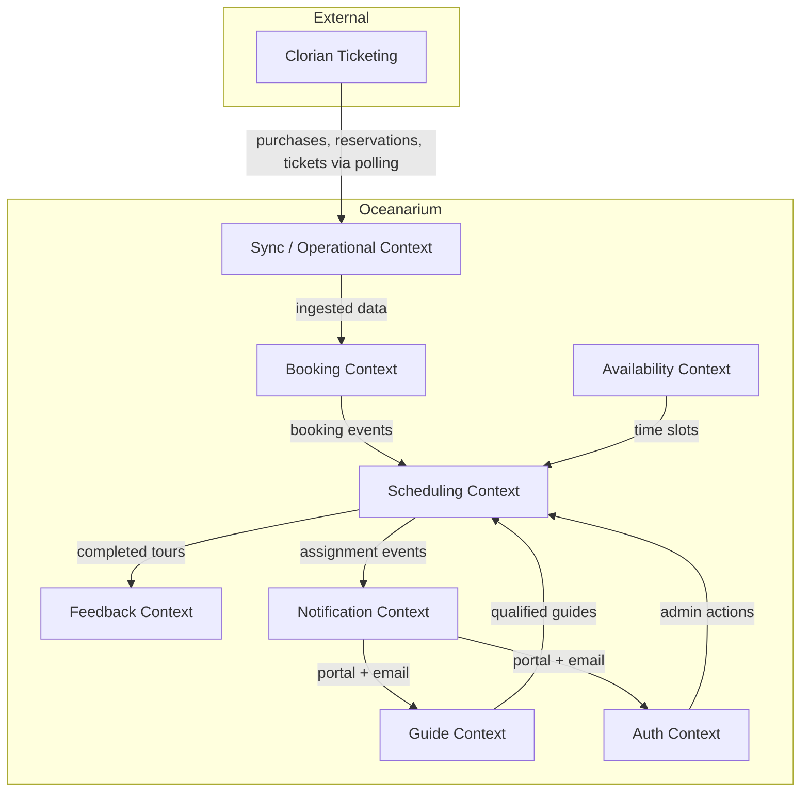

# [DDD-001] Domain Model Overview

| Field            | Value                  |
|------------------|------------------------|
| **ID**           | DDD-001                |
| **Version**      | 2.0                    |
| **Status**       | Draft                  |
| **Author**       | Evandro Maciel         |
| **Created**      | 2026-03-03             |
| **Last Updated** | 2026-03-03             |

---

## 1. Domain Overview

The Oceanarium system manages tour bookings that originate from an external ticketing platform (Clorian), assigns qualified guides to scheduled tours, and tracks availability, feedback, notifications, and operational sync metrics.

The system is **not** the source of truth for ticket sales — Clorian is. The Oceanarium backend is the source of truth for **guide assignment**, **scheduling**, **notifications**, and **operational orchestration**.

### Problem Statement

Currently, the Oceanarium handles all post-sale operations manually:
- Creating schedules
- Assigning bookings to schedules
- Organizing bookings by language, expertise, and timeslot
- Searching for and matching guides

### What We Solve

- Auto-schedule one guide for many bookings (each booking can have many tickets: adults, children)
- Auto-replace a guide when they can't make an assigned tour
- Auto-reassign bookings when they change (date/time, language, tour)
- Auto-remove cancelled bookings from schedules
- Notify admins and guides of every change (portal + email)

### What We Don't Handle

- Capacity control per schedule (Clorian's responsibility)
- Resource management for tours (future phase)

## 2. Ubiquitous Language

| Term | Definition |
|------|-----------|
| **Customer** | A person who purchases tickets through Clorian, identified by `clientId` |
| **Purchase** | A customer transaction from Clorian; carries `language_code` and groups one or more reservations |
| **Booking** | Maps to a Clorian Reservation — a specific tour at a specific time; the **schedulable unit** |
| **Booking Version** | An immutable snapshot of a booking's state; used for change detection via `hash` |
| **Ticket** | An individual attendee within a booking (e.g., "Children 6–10 years", "Adult"); maps to a Clorian Ticket |
| **Schedule** | An internal grouping of N bookings that share the same tour, language, and timeslot; assigned to exactly one guide |
| **Guide** | A tour guide employed by the Oceanarium with language capabilities, availability, and tour qualifications |
| **Tour** | A predefined tour program (e.g., "Ocean Discovery Tour") mapped from Clorian's `productId` |
| **Assignment** | The act of linking a guide to a schedule based on three hard constraints |
| **Availability Pattern** | A guide's recurring weekly availability template |
| **Availability Exception** | A date-specific override (holiday, sick day, etc.) |
| **Poll Execution** | A single run of the Clorian polling job |
| **Survey** | Post-tour feedback from a customer about a guide |
| **Notification** | A message sent to an admin or guide via portal or email about a scheduling change |

## 3. Bounded Contexts



### Context Responsibilities

| Context | Responsibility | Key Entities |
|---------|---------------|--------------|
| **Booking** | Owns customer, purchase, booking, and ticket data ingested from Clorian | `customers`, `purchases`, `bookings`, `booking_versions`, `tickets` |
| **Scheduling** | Groups bookings into schedules, assigns guides, handles re-scheduling | `schedule`, `tour_assignment_logs` |
| **Guide** | Manages guide profiles, qualifications, and language capabilities | `guides`, `languages`, `guide_languages`, `guide_tour_types` |
| **Availability** | Defines and queries guide availability | `availability_patterns`, `availability_slots`, `availability_exceptions` |
| **Feedback** | Collects post-tour surveys | `surveys` |
| **Notification** | Dispatches portal and email notifications to admins and guides | `notifications` |
| **Sync / Operational** | Orchestrates Clorian polling and tracks sync health | `poll_execution`, `sync_logs` |
| **Auth** | User authentication and authorization | `users` |

## 4. Aggregates

### Aggregate: Purchase

- **Root Entity**: `purchases`
- **Value Objects**: N/A
- **Children**: `bookings` (via `purchase_id`)
- **Invariants**:
  - A purchase must have exactly one `clorian_purchase_id` (unique)
  - `language_code` is required and drives schedule-level language grouping

### Aggregate: Booking

- **Root Entity**: `bookings`
- **Value Objects**: `booking_versions` (immutable snapshots)
- **Children**: `tickets` (via `booking_id`)
- **Invariants**:
  - A booking must have exactly one `clorian_reservation_id` (unique)
  - Versions are append-only; existing versions are never mutated
  - The "current" version is the one with the latest `valid_from`
  - A booking belongs to at most one schedule

### Aggregate: Schedule

- **Root Entity**: `schedule`
- **Invariants**:
  - A schedule must have exactly one guide (or be in `UNASSIGNED` / `UNASSIGNABLE` state)
  - All bookings in a schedule must share the same `tour_id`, `language_code`, and `event_start_datetime`
  - A guide cannot be assigned to overlapping schedules
  - Status transitions: `UNASSIGNED` → `ASSIGNED` → `COMPLETED` or `CANCELLED`

### Aggregate: Guide

- **Root Entity**: `guides`
- **Value Objects**: language capabilities (`guide_languages`), tour qualifications (`guide_tour_types`)
- **Invariants**:
  - A guide must be `is_active = true` to receive new assignments
  - Guide qualifications and language skills must be set before assignment

### Aggregate: Availability

- **Root Entity**: `availability_patterns`
- **Value Objects**: `availability_slots`, `availability_exceptions`
- **Invariants**:
  - Slots within the same pattern must not overlap
  - An exception on a specific date overrides the recurring slot for that day

## 5. Domain Events

| Event | Trigger | Consumers | Reference |
|-------|---------|-----------|-----------|
| `PurchaseIngested` | New purchase from Clorian | Booking Context | FDR-001 |
| `PurchaseLanguageChanged` | Language code changed on purchase | Re-scheduling Service | FDR-004 FR-2 |
| `BookingIngested` | New booking from Clorian | Scheduling Context | FDR-001 |
| `BookingTimeChanged` | `event_start_datetime` changed | Re-scheduling Service | FDR-004 FR-1 |
| `BookingTourChanged` | `tour_id` changed | Re-scheduling Service | FDR-004 FR-3 |
| `BookingCancelled` | Status changed to `cancelled` | Re-scheduling Service | FDR-004 FR-4 |
| `ScheduleCreated` | Bookings grouped into a new schedule | Guide Assignment Service | FDR-002 |
| `GuideAssigned` | Guide linked to a schedule | Notification Service, Audit Logger | FDR-003 FR-1 |
| `GuideReassigned` | Guide replaced on a schedule | Notification Service, Audit Logger | FDR-003 FR-2 |
| `GuideUnassigned` | Guide removed from a schedule | Notification Service, Audit Logger | FDR-003 FR-2 |
| `GuideCancelled` | Guide marks unavailable for schedule | Re-scheduling Service | FDR-004 FR-5 |
| `ScheduleUnassignable` | No guide matches constraints | Notification Service (urgent) | FDR-003 FR-5 |
| `BookingRemovedFromSchedule` | Booking taken out of schedule | Notification Service | FDR-003 FR-3 |
| `BookingMovedToSchedule` | Booking moved between schedules | Notification Service | FDR-003 FR-4 |
| `PollCompleted` | Clorian polling cycle finished | Sync Logs | FDR-001 |
| `SurveySubmitted` | Customer submits feedback | Guide Rating Service | — |

## 6. Domain Services

| Service | Responsibility | References |
|---------|---------------|------------|
| **ClorianPollerService** | Executes polling, ingests 3-level data (purchases, reservations, tickets) | FDR-001 |
| **BookingIngestionService** | Processes raw Clorian data, upserts entities, detects changes, emits events | FDR-001 |
| **ScheduleBuilderService** | Groups compatible bookings into schedules (same tour + language + timeslot) | FDR-004 FR-6 |
| **GuideAssignmentService** | Evaluates language + availability + expertise constraints, selects best guide | FDR-002 |
| **ReSchedulingService** | Reacts to booking/guide changes, adjusts schedules and reassigns guides | FDR-004 |
| **NotificationService** | Dispatches portal + email notifications to admins and guides | FDR-003 |
| **AvailabilityQueryService** | Resolves guide availability for a given date/time considering patterns + exceptions | FDR-002 FR-2 |

## 7. Repository Interfaces

| Repository | Aggregate | Key Operations |
|-----------|-----------|----------------|
| `CustomerRepository` | Customer | `upsert_by_client_id()` |
| `PurchaseRepository` | Purchase | `find_by_clorian_id()`, `create()`, `update()` |
| `BookingRepository` | Booking | `find_by_clorian_reservation_id()`, `create()`, `add_version()`, `update_schedule()` |
| `TicketRepository` | Ticket | `find_by_clorian_ticket_id()`, `create()`, `update()` |
| `ScheduleRepository` | Schedule | `find_matching(tour_id, language_code, event_start)`, `find_unassigned()`, `assign_guide()`, `cancel()` |
| `GuideRepository` | Guide | `find_eligible(tour_id, language_code, date, time_range)` |
| `AvailabilityRepository` | Availability | `get_patterns(guide_id)`, `get_exceptions(guide_id, date)` |
| `NotificationRepository` | Notification | `create()`, `mark_sent()`, `find_by_user()` |
| `SurveyRepository` | Survey | `create()`, `find_by_guide()` |

## 8. Context Map

```
┌─────────────────────────────────────────────────────────────────────┐
│                          EXTERNAL                                   │
│  ┌──────────┐                                                       │
│  │ Clorian  │──── Polling (ACL) ────┐                               │
│  │ Purchase │                       │                               │
│  │ Reserv.  │                       │                               │
│  │ Ticket   │                       │                               │
│  └──────────┘                       │                               │
└─────────────────────────────────────┼───────────────────────────────┘
                                      ▼
┌─────────────────────────────────────────────────────────────────────┐
│                      OCEANARIUM SYSTEM                               │
│                                                                     │
│  ┌──────────────┐    ┌──────────────┐    ┌──────────────┐           │
│  │    Sync /    │───▶│   Booking    │───▶│  Scheduling  │           │
│  │ Operational  │    │   Context    │    │   Context    │           │
│  │              │    │              │    │              │           │
│  │ poll_exec    │    │ customers    │    │ schedule     │           │
│  │ sync_logs    │    │ purchases    │    │ assignment   │           │
│  └──────────────┘    │ bookings     │    │ logs         │           │
│                      │ versions     │    └──────┬───────┘           │
│                      │ tickets      │           │                   │
│                      └──────────────┘    ┌──────┴───────┐           │
│                                          │              │           │
│                           ┌──────────────┤              │           │
│                           │              │              │           │
│                           ▼              ▼              ▼           │
│                    ┌──────────────┐ ┌──────────┐ ┌─────────────┐   │
│                    │    Guide     │ │Availabil.│ │ Notification│   │
│                    │   Context    │ │ Context  │ │   Context   │   │
│                    │              │ │          │ │             │   │
│                    │ guides       │ │ patterns │ │ portal      │   │
│                    │ languages    │ │ slots    │ │ email       │   │
│                    │ guide_langs  │ │ except.  │ │             │   │
│                    │ guide_tours  │ └──────────┘ └─────────────┘   │
│                    └──────────────┘                                 │
│                                                                     │
│  ┌──────────────┐                     ┌──────────────┐             │
│  │   Feedback   │◀── after tour ─────│  Scheduling  │             │
│  │   Context    │                     │   Context    │             │
│  └──────────────┘                     └──────────────┘             │
│                                                                     │
│  ┌──────────────┐                                                   │
│  │     Auth     │──── admin actions ──▶ Scheduling + Notification   │
│  │   Context    │                                                   │
│  └──────────────┘                                                   │
└─────────────────────────────────────────────────────────────────────┘

Integration Patterns:
  Clorian → Sync:          Anti-Corruption Layer (ACL) via polling
  Sync → Booking:          Shared Kernel (same DB, direct writes)
  Booking → Scheduling:    Domain Events (BookingIngested, BookingChanged, etc.)
  Scheduling → Notification: Domain Events (GuideAssigned, ScheduleUnassignable, etc.)
  Guide/Availability → Scheduling: Query interface (read-only)
```

## Changelog

| Version | Date       | Author          | Description |
|---------|------------|-----------------|-------------|
| 1.0     | 2026-03-03 | Evandro Maciel | Initial domain model — 7 bounded contexts |
| 2.0     | 2026-03-03 | Evandro Maciel | Added Purchase, Ticket, Notification contexts (now 8); added problem statement; expanded domain events with FDR references; updated aggregates, services, and repositories for 3-level Clorian model |
