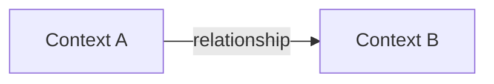

# [DDD-XXX] Title

| Field            | Value                  |
|------------------|------------------------|
| **ID**           | DDD-XXX                |
| **Version**      | 1.0                    |
| **Status**       | Draft / Active / Deprecated |
| **Author**       | Evandro Maciel         |
| **Created**      | YYYY-MM-DD             |
| **Last Updated** | YYYY-MM-DD             |

---

## 1. Domain Overview

_High-level description of this bounded context or domain area._

## 2. Ubiquitous Language

| Term | Definition |
|------|-----------|
|      |           |

## 3. Bounded Contexts

## 4. Aggregates

### Aggregate: Name

- **Root Entity**:
- **Value Objects**:
- **Invariants**:

## 5. Domain Events

| Event | Trigger | Consumers |
|-------|---------|-----------|
|       |         |           |

## 6. Domain Services

| Service | Responsibility |
|---------|---------------|
|         |               |

## 7. Repository Interfaces

| Repository | Aggregate | Key Operations |
|-----------|-----------|----------------|
|           |           |                |

## 8. Context Map

_How this domain interacts with other domains / external systems._

## Changelog

| Version | Date       | Author | Description |
|---------|------------|--------|-------------|
| 1.0     | YYYY-MM-DD |        | Initial     |
