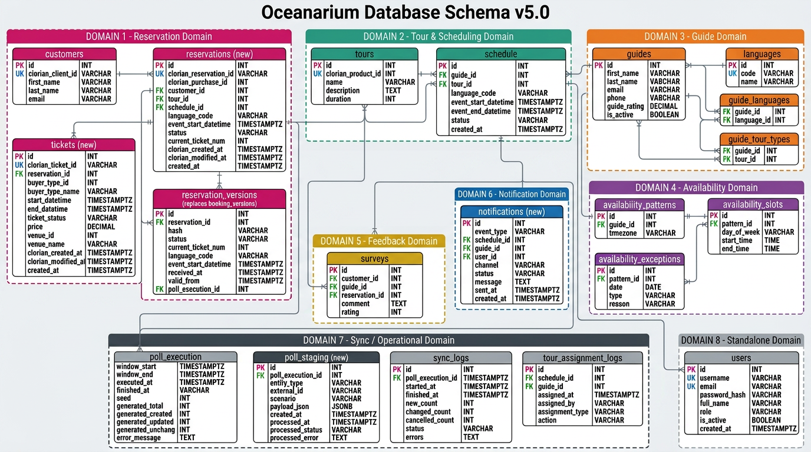

# Oceanarium Database Schema — ERD

| Field            | Value                  |
|------------------|------------------------|
| **Version**      | 5.0                    |
| **Status**       | Active                 |
| **Author**       | Evandro Maciel         |
| **Created**      | 2026-03-03             |
| **Last Updated** | 2026-03-11             |

> Clorian hierarchy: **Purchase → Reservation → Ticket** maps to our **customers → reservations → tickets**.
>
> `purchases` table dropped — `language_code`, `customer_id`, and `clorian_purchase_id` denormalized onto `reservations`.
>
> Excluded: ~~cost~~, ~~resources~~, ~~tour_resources~~, ~~issues~~, ~~purchases~~.

## Visual ERD

> **Source files:** The editable diagram is [`oceanarium-erd-v5.0.drawio`](oceanarium-erd-v5.0.drawio) (open with [draw.io](https://app.diagrams.net)).
> To regenerate from code, run `python3 generate_erd.py` then `drawio --export --format png --scale 2 --output oceanarium-erd-v5.0.png oceanarium-erd-v5.0.drawio`.

## Diagram

```mermaid
erDiagram
    %% ========== RESERVATION DOMAIN ==========

    customers {
        int id PK
        varchar clorian_client_id UK
        varchar first_name
        varchar last_name
        varchar email
    }

    reservations {
        int id PK
        varchar clorian_reservation_id UK
        int clorian_purchase_id
        int customer_id FK
        int tour_id FK
        int schedule_id FK
        varchar language_code
        timestamptz event_start_datetime
        varchar status
        int current_ticket_num
        timestamptz clorian_created_at
        timestamptz clorian_modified_at
        timestamptz created_at
    }

    reservation_versions {
        int id PK
        int reservation_id FK
        varchar hash
        varchar status
        int current_ticket_num
        varchar language_code
        timestamptz event_start_datetime
        timestamptz received_at
        timestamptz valid_from
        int poll_execution_id FK
    }

    tickets {
        int id PK
        varchar clorian_ticket_id UK
        int reservation_id FK
        int buyer_type_id
        varchar buyer_type_name
        timestamptz start_datetime
        timestamptz end_datetime
        varchar ticket_status
        decimal price
        int venue_id
        varchar venue_name
        timestamptz clorian_created_at
        timestamptz clorian_modified_at
        timestamptz created_at
    }

    %% ========== TOUR & SCHEDULING DOMAIN ==========

    tours {
        int id PK
        int clorian_product_id UK
        varchar name
        text description
        int duration
    }

    schedule {
        int id PK
        int guide_id FK
        int tour_id FK
        varchar language_code
        timestamptz event_start_datetime
        timestamptz event_end_datetime
        varchar status
        timestamptz created_at
    }

    %% ========== GUIDE DOMAIN ==========

    guides {
        int id PK
        varchar first_name
        varchar last_name
        varchar email
        varchar phone
        decimal guide_rating
        boolean is_active
    }

    languages {
        int id PK
        varchar code UK
        varchar name
    }

    guide_languages {
        int guide_id FK
        int language_id FK
    }

    guide_tour_types {
        int guide_id FK
        int tour_id FK
    }

    %% ========== AVAILABILITY DOMAIN ==========

    availability_patterns {
        int id PK
        int guide_id FK
        varchar timezone
    }

    availability_slots {
        int id PK
        int pattern_id FK
        varchar day_of_week
        time start_time
        time end_time
    }

    availability_exceptions {
        int id PK
        int pattern_id FK
        date date
        varchar type
        varchar reason
    }

    %% ========== FEEDBACK DOMAIN ==========

    surveys {
        int id PK
        int customer_id FK
        int guide_id FK
        int reservation_id FK
        text comment
        int rating
    }

    %% ========== NOTIFICATION DOMAIN ==========

    notifications {
        int id PK
        varchar event_type
        int schedule_id FK
        int guide_id FK
        int user_id FK
        varchar channel
        varchar status
        text message
        timestamptz sent_at
        timestamptz created_at
    }

    %% ========== SYNC / OPERATIONAL DOMAIN ==========

    poll_execution {
        int id PK
        timestamptz window_start
        timestamptz window_end
        timestamptz executed_at
        timestamptz finished_at
        varchar status
        int seed
        int generated_total
        int generated_created
        int generated_updated
        int generated_unchanged
        text error_message
    }

    poll_staging {
        int id PK
        int poll_execution_id FK
        varchar entity_type
        varchar external_id
        varchar scenario
        jsonb payload_json
        timestamptz created_at
        timestamptz processed_at
        varchar processed_status
        text processed_error
    }

    sync_logs {
        int id PK
        int poll_execution_id FK
        timestamptz started_at
        timestamptz finished_at
        int new_count
        int changed_count
        int cancelled_count
        varchar status
        text errors
    }

    tour_assignment_logs {
        int id PK
        int schedule_id FK
        int guide_id FK
        timestamptz assigned_at
        varchar assigned_by
        varchar assignment_type
        varchar action
    }

    %% ========== AUTH / STANDALONE ==========

    users {
        int id PK
        varchar username UK
        varchar email UK
        varchar password_hash
        varchar full_name
        varchar role
        boolean is_active
        timestamptz created_at
    }

    %% ========== RELATIONSHIPS ==========

    customers ||--o{ reservations : "has many"
    reservations ||--o{ tickets : "has many"
    reservations ||--o{ reservation_versions : "has many"
    tours ||--o{ reservations : "for tour"
    schedule ||--o{ reservations : "groups"
    schedule ||--o{ notifications : "triggers"
    poll_execution ||--o{ reservation_versions : "produced in"
    poll_execution ||--o{ poll_staging : "stages into"
    poll_execution ||--o{ sync_logs : "tracked by"
    guides ||--o{ schedule : "assigned to"
    guides ||--o{ guide_languages : "speaks"
    languages ||--o{ guide_languages : "spoken by"
    guides ||--o{ guide_tour_types : "qualified for"
    tours ||--o{ guide_tour_types : "staffed by"
    tours ||--o{ schedule : "scheduled for"
    guides ||--o{ availability_patterns : "defines"
    availability_patterns ||--o{ availability_slots : "has"
    availability_patterns ||--o{ availability_exceptions : "has"
    customers ||--o{ surveys : "submits"
    guides ||--o{ surveys : "receives"
    reservations ||--o{ surveys : "reviewed via"
    guides ||--o{ notifications : "notified"
    users ||--o{ notifications : "notified"
    schedule ||--o{ tour_assignment_logs : "logged for"
    guides ||--o{ tour_assignment_logs : "logged for"
```

---

## Clorian → Oceanarium Mapping

| Clorian Entity | Clorian ID Field | Our Table | Our UK Field | Relationship |
|---|---|---|---|---|
| **Purchase** | `purchaseId` | `reservations` | `clorian_purchase_id` (denormalized) | Purchase data folded into reservations |
| **Reservation** | `reservationId` | `reservations` | `clorian_reservation_id` | The schedulable unit |
| **Ticket** | `ticketId` | `tickets` | `clorian_ticket_id` | Individual attendees |

---

## Domain Breakdown

### 1. Reservation Domain

| Table | Columns | Notes |
|-------|---------|-------|
| **customers** | `id` PK, `clorian_client_id` UK (VARCHAR 100), `first_name`, `last_name`, `email` | Upserted from Clorian purchase `clientId` |
| **reservations** | `id` PK, `clorian_reservation_id` UK (VARCHAR 100), `clorian_purchase_id`, `customer_id` FK→customers, `tour_id` FK→tours, `schedule_id` FK→schedule (nullable), `language_code`, `event_start_datetime`, `status`, `current_ticket_num`, `clorian_created_at`, `clorian_modified_at`, `created_at` | Maps to Clorian Reservation; `language_code` and `customer_id` denormalized from Purchase |
| **reservation_versions** | `id` PK, `reservation_id` FK→reservations, `hash`, `status`, `current_ticket_num`, `language_code`, `event_start_datetime`, `received_at`, `valid_from`, `poll_execution_id` FK→poll_execution | Immutable snapshot per ingestion; `hash` for change detection |
| **tickets** | `id` PK, `clorian_ticket_id` UK (VARCHAR 100), `reservation_id` FK→reservations, `buyer_type_id`, `buyer_type_name`, `start_datetime`, `end_datetime`, `ticket_status`, `price`, `venue_id`, `venue_name`, `clorian_created_at`, `clorian_modified_at`, `created_at` | Individual attendees (adult, child, etc.) |

### 2. Tour & Scheduling Domain

| Table | Columns | Notes |
|-------|---------|-------|
| **tours** | `id` PK, `clorian_product_id` UK, `name`, `description` (TEXT), `duration` (INT) | Mapped from Clorian `productId`/`productName` |
| **schedule** | `id` PK, `guide_id` FK→guides (nullable), `tour_id` FK→tours, `language_code`, `event_start_datetime`, `event_end_datetime`, `status`, `created_at` | Groups N reservations by tour + language + timeslot; `status`: `UNASSIGNED` / `ASSIGNED` / `COMPLETED` / `CANCELLED` |

### 3. Guide Domain

| Table | Columns | Notes |
|-------|---------|-------|
| **guides** | `id` PK, `first_name`, `last_name`, `email`, `phone`, `guide_rating` (DECIMAL), `is_active` (BOOLEAN) | Guide profile |
| **languages** | `id` PK, `code` UK, `name` | Reference table |
| **guide_languages** | `guide_id` FK→guides, `language_id` FK→languages | Junction — which languages a guide speaks |
| **guide_tour_types** | `guide_id` FK→guides, `tour_id` FK→tours | Junction — which tours a guide is qualified to lead |

### 4. Availability Domain

| Table | Columns | Notes |
|-------|---------|-------|
| **availability_patterns** | `id` PK, `guide_id` FK→guides, `timezone` | Recurring availability template per guide |
| **availability_slots** | `id` PK, `pattern_id` FK→availability_patterns, `day_of_week`, `start_time`, `end_time` | Weekly recurring time slots |
| **availability_exceptions** | `id` PK, `pattern_id` FK→availability_patterns, `date`, `type`, `reason` | Overrides (holidays, sick days, etc.) |

### 5. Feedback Domain

| Table | Columns | Notes |
|-------|---------|-------|
| **surveys** | `id` PK, `customer_id` FK→customers, `guide_id` FK→guides, `reservation_id` FK→reservations, `comment` (TEXT), `rating` (INT) | Post-tour feedback |

### 6. Notification Domain

| Table | Columns | Notes |
|-------|---------|-------|
| **notifications** | `id` PK, `event_type`, `schedule_id` FK→schedule, `guide_id` FK→guides (nullable), `user_id` FK→users (nullable), `channel`, `status`, `message` (TEXT), `sent_at`, `created_at` | Portal + email notifications |

### 7. Sync / Operational Domain

| Table | Columns | Notes |
|-------|---------|-------|
| **poll_execution** | `id` PK, `window_start`, `window_end`, `executed_at`, `finished_at`, `status`, `seed`, `generated_total`, `generated_created`, `generated_updated`, `generated_unchanged`, `error_message` (TEXT) | Tracks each Clorian polling cycle with generation metrics |
| **poll_staging** | `id` PK, `poll_execution_id` FK→poll_execution, `entity_type`, `external_id`, `scenario`, `payload_json` (JSONB), `created_at`, `processed_at`, `processed_status`, `processed_error` (TEXT) | Staging/inbox for raw Clorian payloads before processing |
| **sync_logs** | `id` PK, `poll_execution_id` FK→poll_execution, `started_at`, `finished_at`, `new_count`, `changed_count`, `cancelled_count`, `status`, `errors` (TEXT) | Aggregated sync run metrics |
| **tour_assignment_logs** | `id` PK, `schedule_id` FK→schedule, `guide_id` FK→guides, `assigned_at`, `assigned_by`, `assignment_type`, `action` | Audit trail for guide assignments |

### 8. Auth / Standalone

| Table | Columns | Notes |
|-------|---------|-------|
| **users** | `id` PK, `username` UK, `email` UK, `password_hash`, `full_name`, `role`, `is_active` (BOOLEAN), `created_at` | Internal app users (staff, admins) |

---

## Excluded Tables

| Table | Reason | Reference |
|-------|--------|-----------|
| ~~cost~~ | Removed from scope | — |
| ~~resources~~ | Removed from scope (future phase) | — |
| ~~tour_resources~~ | Removed from scope (future phase) | — |
| ~~issues~~ | Removed from scope | — |
| ~~purchases~~ | Denormalized onto reservations — `language_code`, `customer_id`, `clorian_purchase_id` | [ADR-001] |

---

## Key Design Decisions

| Decision | Reference |
|----------|-----------|
| Clorian Reservation = our `reservations`; `purchases` denormalized; no separate reservation abstraction | [ADR-001](../ADR/ADR-001-drop-reservation-table.md) |
| Layered domain architecture with adapters | [ADR-002](../ADR/ADR-002-layered-domain-architecture.md) |
| 3-level Clorian ingestion mapped to reservations + tickets | [FDR-001](../FDR/FDR-001-booking-ingestion-from-clorian.md) |
| Guide assignment via 3 hard constraints (language, availability, expertise) | [FDR-002](../FDR/FDR-002-guide-assignment-rules.md) |
| Notifications to Admin + Guide on every scheduling change | [FDR-003](../FDR/FDR-003-notifications.md) |
| Auto re-scheduling on reservation changes and guide cancellations | [FDR-004](../FDR/FDR-004-auto-rescheduling.md) |
| Domain-driven bounded contexts (8 contexts) | [DDD-001](../DDD/DDD-001-domain-model-overview.md) |

## Changelog

| Version | Date       | Author          | Description |
|---------|------------|-----------------|-------------|
| 1.0     | 2026-03-03 | Evandro Maciel | Initial ERD from existing codebase |
| 2.0     | 2026-03-03 | Evandro Maciel | Target schema: dropped reservation table, added `schedule_id` FK on bookings, added `guide_languages` junction table |
| 3.0     | 2026-03-03 | Evandro Maciel | Clorian 3-level model: added `purchases`, `tickets`, `notifications`; reshaped bookings |
| 4.0     | 2026-03-03 | Evandro Maciel | Renamed `bookings`→`reservations`, `booking_versions`→`reservation_versions`; dropped `purchases` table (denormalized onto reservations); added `clorian_client_id` to customers |
| 4.1     | 2026-03-11 | Evandro Maciel | Status promoted to Active; aligned with [DB-001](DB-001-initial-schema-migration.md) deployed schema |
| 5.0     | 2026-03-11 | Evandro Maciel | Aligned with production: added `poll_staging` table; added `seed`, `finished_at`, `generated_*`, `error_message` to `poll_execution`; changed `clorian_client_id`, `clorian_reservation_id`, `clorian_ticket_id` from INTEGER to VARCHAR(100) |
