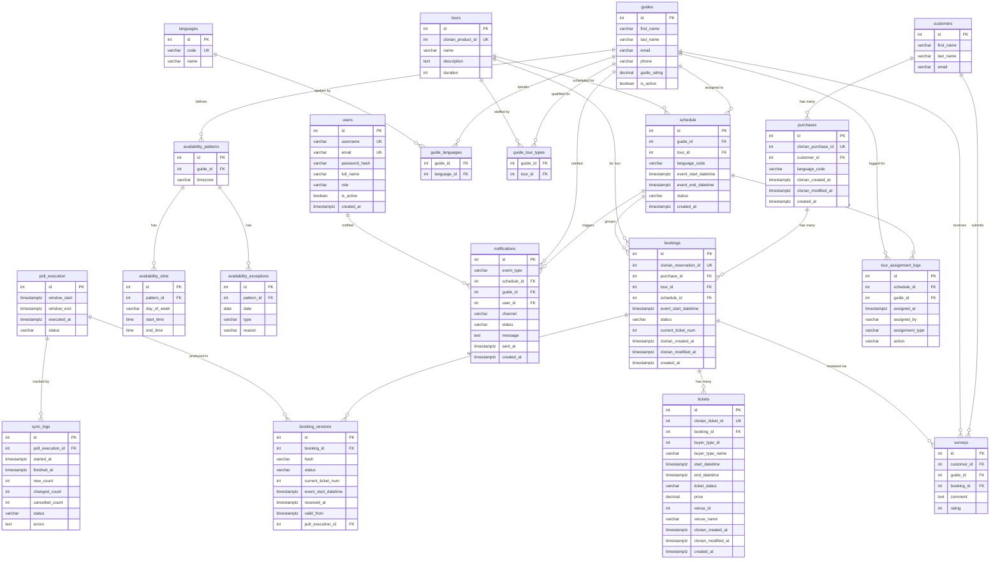

# Oceanarium Database Schema — ERD

| Field            | Value                  |
|------------------|------------------------|
| **Version**      | 3.0                    |
| **Status**       | Draft                  |
| **Author**       | Evandro Maciel         |
| **Created**      | 2026-03-03             |
| **Last Updated** | 2026-03-03             |

> Clorian hierarchy: **Purchase → Reservation → Ticket** maps to our **purchases → bookings → tickets**.
>
> Excluded: ~~cost~~, ~~resources~~, ~~tour_resources~~, ~~issues~~, ~~reservation as separate table~~ (see [ADR-001]).

## Diagram

---

## Clorian → Oceanarium Mapping

| Clorian Entity | Clorian ID Field | Our Table | Our UK Field | Relationship |
|---|---|---|---|---|
| **Purchase** | `purchaseId` | `purchases` | `clorian_purchase_id` | 1 purchase → N reservations |
| **Reservation** | `reservationId` | `bookings` | `clorian_reservation_id` | 1 reservation → N tickets |
| **Ticket** | `ticketId` | `tickets` | `clorian_ticket_id` | Leaf entity (attendee) |

---

## Domain Breakdown

### 1. Booking Domain

| Table | Columns | Notes |
|-------|---------|-------|
| **customers** | `id` PK, `first_name`, `last_name`, `email` | Upserted from Clorian purchase `clientId` |
| **purchases** | `id` PK, `clorian_purchase_id` UK, `customer_id` FK→customers, `language_code`, `clorian_created_at`, `clorian_modified_at`, `created_at` | Maps to Clorian Purchase; carries `language_code` for guide matching |
| **bookings** | `id` PK, `clorian_reservation_id` UK, `purchase_id` FK→purchases, `tour_id` FK→tours, `schedule_id` FK→schedule (nullable), `event_start_datetime`, `status`, `current_ticket_num`, `clorian_created_at`, `clorian_modified_at`, `created_at` | Maps to Clorian Reservation; the **schedulable unit** |
| **booking_versions** | `id` PK, `booking_id` FK→bookings, `hash`, `status`, `current_ticket_num`, `event_start_datetime`, `received_at`, `valid_from`, `poll_execution_id` FK→poll_execution | Immutable snapshot per ingestion; `hash` for change detection |
| **tickets** | `id` PK, `clorian_ticket_id` UK, `booking_id` FK→bookings, `buyer_type_id`, `buyer_type_name`, `start_datetime`, `end_datetime`, `ticket_status`, `price`, `venue_id`, `venue_name`, `clorian_created_at`, `clorian_modified_at`, `created_at` | Maps to Clorian Ticket; individual attendees (adult, child, etc.) |

### 2. Tour & Scheduling Domain

| Table | Columns | Notes |
|-------|---------|-------|
| **tours** | `id` PK, `clorian_product_id` UK, `name`, `description` (TEXT), `duration` (INT) | Mapped from Clorian `productId`/`productName` |
| **schedule** | `id` PK, `guide_id` FK→guides (nullable), `tour_id` FK→tours, `language_code`, `event_start_datetime`, `event_end_datetime`, `status`, `created_at` | Groups N bookings by tour + language + timeslot; `status`: `UNASSIGNED`, `ASSIGNED`, `COMPLETED`, `CANCELLED` |

### 3. Guide Domain

| Table | Columns | Notes |
|-------|---------|-------|
| **guides** | `id` PK, `first_name`, `last_name`, `email`, `phone`, `guide_rating` (DECIMAL), `is_active` (BOOLEAN) | Guide profile |
| **languages** | `id` PK, `code` UK, `name` | Reference table |
| **guide_languages** | `guide_id` FK→guides, `language_id` FK→languages | Junction — which languages a guide speaks |
| **guide_tour_types** | `guide_id` FK→guides, `tour_id` FK→tours | Junction — which tours a guide is qualified to lead |

### 4. Availability Domain

| Table | Columns | Notes |
|-------|---------|-------|
| **availability_patterns** | `id` PK, `guide_id` FK→guides, `timezone` | Recurring availability template per guide |
| **availability_slots** | `id` PK, `pattern_id` FK→availability_patterns, `day_of_week`, `start_time`, `end_time` | Weekly recurring time slots |
| **availability_exceptions** | `id` PK, `pattern_id` FK→availability_patterns, `date`, `type`, `reason` | Overrides (holidays, sick days, etc.) |

### 5. Feedback Domain

| Table | Columns | Notes |
|-------|---------|-------|
| **surveys** | `id` PK, `customer_id` FK→customers, `guide_id` FK→guides, `booking_id` FK→bookings, `comment` (TEXT), `rating` (INT) | Post-tour feedback |

### 6. Notification Domain

| Table | Columns | Notes |
|-------|---------|-------|
| **notifications** | `id` PK, `event_type`, `schedule_id` FK→schedule, `guide_id` FK→guides (nullable), `user_id` FK→users (nullable), `channel` (`PORTAL`/`EMAIL`), `status` (`PENDING`/`SENT`/`FAILED`), `message` (TEXT), `sent_at`, `created_at` | Tracks every notification sent to admins and guides |

### 7. Sync / Operational Domain

| Table | Columns | Notes |
|-------|---------|-------|
| **poll_execution** | `id` PK, `window_start`, `window_end`, `executed_at`, `status` | Tracks each Clorian polling cycle |
| **sync_logs** | `id` PK, `poll_execution_id` FK→poll_execution, `started_at`, `finished_at`, `new_count`, `changed_count`, `cancelled_count`, `status`, `errors` (TEXT) | Aggregated sync run metrics |
| **tour_assignment_logs** | `id` PK, `schedule_id` FK→schedule, `guide_id` FK→guides, `assigned_at`, `assigned_by`, `assignment_type`, `action` | Audit trail for guide assignments |

### 8. Auth / Standalone

| Table | Columns | Notes |
|-------|---------|-------|
| **users** | `id` PK, `username` UK, `email` UK, `password_hash`, `full_name`, `role`, `is_active` (BOOLEAN), `created_at` | Internal app users (staff, admins) |

---

## Excluded Tables

| Table | Reason | Reference |
|-------|--------|-----------|
| ~~cost~~ | Removed from scope | — |
| ~~resources~~ | Removed from scope (future phase) | — |
| ~~tour_resources~~ | Removed from scope (future phase) | — |
| ~~issues~~ | Removed from scope | — |
| ~~reservation~~ | Clorian "reservation" maps to `bookings` | [ADR-001] |

---

## Key Design Decisions

| Decision | Reference |
|----------|-----------|
| No reservation table — Clorian reservation = our bookings | [ADR-001](../ADR/ADR-001-drop-reservation-table.md) |
| 3-level Clorian ingestion: Purchase → Reservation → Ticket | [FDR-001](../FDR/FDR-001-booking-ingestion-from-clorian.md) |
| Guide assignment via 3 hard constraints (language, availability, expertise) | [FDR-002](../FDR/FDR-002-guide-assignment-rules.md) |
| Notifications to Admin + Guide on every scheduling change | [FDR-003](../FDR/FDR-003-notifications.md) |
| Auto re-scheduling on booking changes and guide cancellations | [FDR-004](../FDR/FDR-004-auto-rescheduling.md) |
| Domain-driven bounded contexts (8 contexts) | [DDD-001](../DDD/DDD-001-domain-model-overview.md) |

## Changelog

| Version | Date       | Author          | Description |
|---------|------------|-----------------|-------------|
| 1.0     | 2026-03-03 | Evandro Maciel | Initial ERD from existing codebase |
| 2.0     | 2026-03-03 | Evandro Maciel | Target schema: dropped reservation table, added `schedule_id` FK on bookings, added `guide_languages` junction table |
| 3.0     | 2026-03-03 | Evandro Maciel | Clorian 3-level model: added `purchases`, `tickets`, `notifications` tables; reshaped `bookings` to map to Clorian Reservation; `language_code` moved to purchases; `schedule` enriched with `tour_id`, `language_code`, `status`; `tour_assignment_logs` now references schedule instead of tour |
